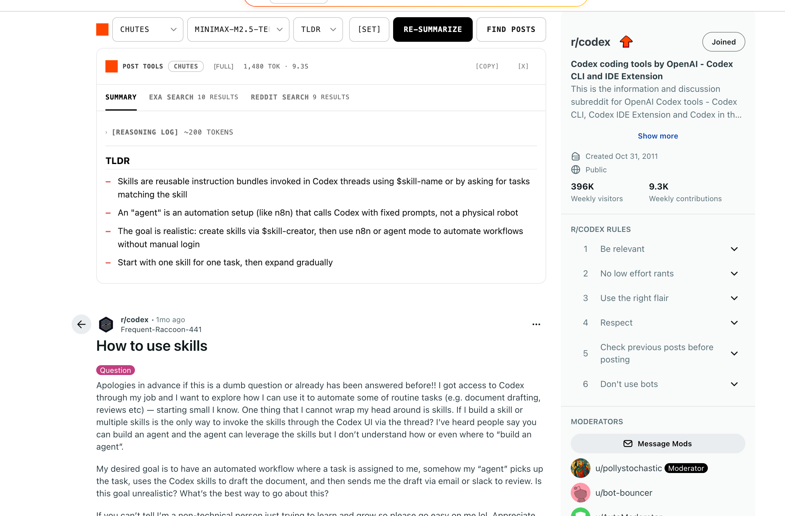

# Reddit Post Summarizer

A Chrome extension that adds an AI-powered summarizer directly to Reddit post pages. It can summarize the current thread, show extraction coverage, search for related posts, and switch between local and OpenAI-compatible providers from the page itself.

Built with [Plasmo](https://www.plasmo.com/), React, TypeScript, Chrome MV3, and a Shadow DOM content UI.



---

## What It Does

- Summarizes Reddit threads from an in-page toolbar.
- Supports local Gemini Nano, local Ollama, built-in API providers, and custom OpenAI-compatible endpoints.
- Streams summaries and preserves reasoning text before the final answer when the provider emits it.
- Finds related posts with Exa search and Reddit search.
- Shows whether a summary is full, partial, cached, or generated fresh.
- Keeps provider API keys out of content-script summarize messages.
- Sanitizes rendered markdown before inserting it into the page.

---

## Features

### AI Summarization

- **9 prompt styles**: Summary, Key Points, ELI5, Critique, Both Sides, Action Plan, TLDR, Timeline, and Signals.
- **Provider/model picker** in the Reddit page toolbar.
- **Streaming output** for providers that support streaming.
- **Reasoning log support** shown before the main summary.
- **Noise reduction rule** in prompts: Reddit usernames and user IDs are avoided unless identity matters.
- **Safe markdown rendering**: model text is parsed with `marked` and sanitized with `DOMPurify`.
- **Token/time usage** shown after API summaries complete.

### Extraction And Coverage

- **Structured extraction metadata** tracks source, post id, subreddit, title, body, comment counts, truncation, warnings, and stats.
- **DOM-first extraction** uses Reddit page selectors for fast summaries.
- **Reddit JSON fallback** improves weak or incomplete DOM extraction.
- **Evidence packing** prioritizes post title, subreddit/post metadata, body, selected comments, truncation notices, and extraction warnings.
- **Minimum content validation** avoids generating misleading summaries from empty or weak extraction.
- **Coverage signal** marks summaries as full, partial, or limited.

### Related Post Finder

- **Exa search** scoped to the current subreddit.
- **Exa search type control**: Instant, Fast, Auto, Deep lite, Deep, and Deep reasoning.
- **Reddit search** via Reddit's public JSON search endpoint.
- **Reddit sort control**: Relevance, Hot, New, Top, and Comments.
- **Result tabs** keep summary, Exa results, and Reddit results separate.

### Provider Support

- **Gemini Nano** through Chrome's built-in `LanguageModel` API when available.
- **Ollama** for local OpenAI-compatible generation.
- **Built-in providers** from [models.dev](https://models.dev), refreshed by the prebuild script.
- **Custom providers** with name, base URL, models, and optional API key.
- **Model list fetching** with timeout/retry behavior.
- **Connection testing** from the Options page.

### Privacy And Safety

- API keys are stored in `chrome.storage.local`.
- Content scripts request summarization by `providerId` and `model`; the background script resolves credentials and calls providers.
- `chrome.storage.local.setAccessLevel({ accessLevel: "TRUSTED_CONTEXTS" })` is used when supported.
- Rendered summary HTML is sanitized before `dangerouslySetInnerHTML`.
- Custom provider host permissions are requested at runtime.

### Cache

- Summary cache is stored in `chrome.storage.local`, not page `localStorage`.
- Cache keys include post/url, style, provider, model, prompt version, and extractor version.
- Cache entries preserve provider/model/style, source, coverage, warnings, and timestamps.
- Old entries are evicted by age/count/estimated size.
- Cache failures do not block showing a generated summary.

### UI

- In-page toolbar on Reddit post pages.
- Collapsible result panel with tabs for summary and related search.
- Nothing-inspired flat visual system with bundled local fonts:
  - Space Grotesk for UI/body text.
  - Space Mono for labels, metadata, and controls.
  - Doto only for rare display accents.
- Light and dark mode support.
- No external font loading.

---

## Installation

### Prerequisites

- [Node.js](https://nodejs.org/) 18+
- [pnpm](https://pnpm.io/)
- Chrome or a Chromium browser that supports MV3 extensions

### Development

```bash
pnpm install
pnpm dev
```

Load the development extension:

1. Open `chrome://extensions/`.
2. Enable **Developer mode**.
3. Click **Load unpacked**.
4. Select `build/chrome-mv3-dev`.

### Production Build

```bash
pnpm build
```

The production bundle is written to `build/chrome-mv3-prod`.

### Package For Distribution

```bash
pnpm package
```

This creates a Chrome Web Store-ready zip from the production build.

---

## Configuration

Open the extension's **Options** page from the popup, extension context menu, or the in-page `[SET]` button.

### AI Providers

| Provider | Type | Setup |
| --- | --- | --- |
| Gemini Nano | Local browser model | Enable Chrome's Prompt API / Gemini Nano support, then select Gemini Nano |
| Ollama | Local OpenAI-compatible endpoint | Run Ollama and use the default local base URL or your own |
| Built-in providers | OpenAI-compatible APIs | Select provider, add API key, test, save |
| Custom provider | Any OpenAI-compatible endpoint | Add name, base URL, models, and optional key |

### Post Finder

In the **Post Finder** tab:

- Toggle Exa search and/or Reddit search.
- Add an Exa API key if using Exa.
- Choose the default Exa search type.
- Save settings before returning to Reddit.

---

## How The Summary Pipeline Works

1. The content script extracts Reddit post content from the page.
2. If extraction is weak or incomplete, the background script can fetch Reddit comments JSON.
3. The prompt packer builds a structured evidence payload instead of sending a raw page text prefix.
4. The content script asks the background script to summarize with `providerId`, `model`, content, and prompts.
5. The background script loads provider settings, attaches credentials, and calls the provider.
6. The panel streams the result, sanitizes markdown, and stores a versioned cache entry.

---

## Project Structure

```text
├── assets/
│   └── icon.png
├── scripts/
│   └── prebuild.mjs
├── src/
│   ├── background.ts
│   ├── content.tsx
│   ├── options.tsx
│   ├── popup.tsx
│   ├── components/
│   │   ├── SummaryPanel.tsx
│   │   ├── Toolbar.tsx
│   │   └── SummarizeButton.tsx
│   ├── lib/
│   │   ├── cache.ts
│   │   ├── exa.ts
│   │   ├── language-model.ts
│   │   ├── models-cache.ts
│   │   ├── prompt-packer.ts
│   │   ├── providers.ts
│   │   ├── reddit-extractor.ts
│   │   ├── reddit-search.ts
│   │   ├── runtime.ts
│   │   ├── storage.ts
│   │   └── styles.ts
│   └── types/
│       └── language-model.d.ts
├── package.json
├── pnpm-lock.yaml
├── screenshot.png
└── tsconfig.json
```

---

## Scripts

| Command | Purpose |
| --- | --- |
| `pnpm dev` | Refresh provider metadata and start Plasmo dev mode |
| `pnpm build` | Build the Chrome MV3 extension |
| `pnpm package` | Package the extension for distribution |
| `pnpm prebuild` | Fetch models.dev provider metadata and patch host permissions |

---

## Permissions

- `storage`: settings, provider configuration, API keys, model metadata, and summary cache.
- Reddit host permissions: content script injection and Reddit JSON fallback/search.
- Provider host permissions: background API calls to configured providers.
- Exa host permission: related post search.
- Optional host permissions: custom provider endpoints requested at runtime.

---

## Troubleshooting

### Missing API Key

Open Options, select the provider, add the key, test the connection, and save.

### Ollama CORS / 403

Ollama can block extension requests by default. Start Ollama with an origin setting that allows the extension, for example:

```bash
OLLAMA_ORIGINS=* ollama serve
```

### Gemini Nano Unavailable

Gemini Nano depends on Chrome support and local model readiness. If it is unavailable or downloading, choose an API provider or Ollama.

### Weak Or Partial Coverage

Partial coverage usually means the extractor detected fewer comments than expected, had to truncate long evidence, or used fallback extraction. Retry after Reddit finishes loading comments, or open the original thread.

---

## License

MIT
